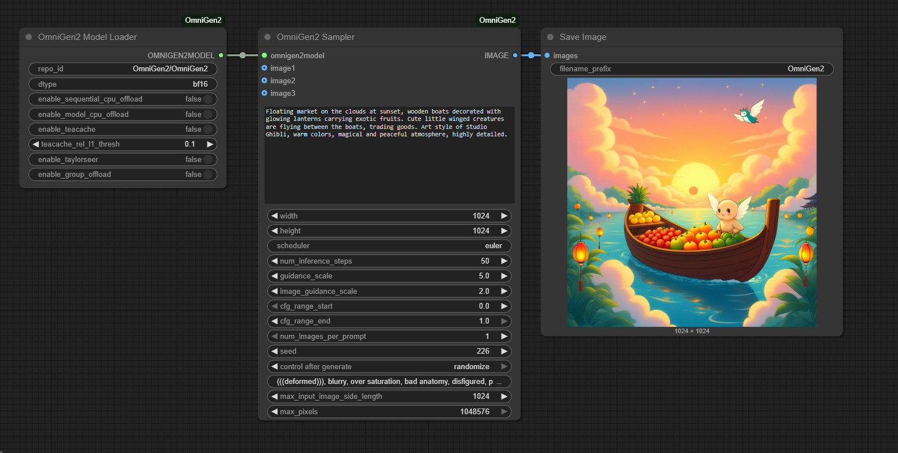

<p align="center">
  
</p>

# ComfyUI-OmniGen2

A ComfyUI custom node package for the [OmniGen2](https://github.com/VectorSpaceLab/OmniGen2) multimodal generation model.

---

## About OmniGen2

OmniGen2 is an open-source, state-of-the-art multimodal generative model supporting text-to-image, image editing, in-context generation, and visual understanding. It features decoupled text/image decoding, robust visual reasoning, and efficient inference with advanced offloading and quantization options. OmniGen2 achieves competitive results on both understanding and generation tasks, and is designed for research and creative applications.

- **Visual Understanding**: Strong image analysis and Q&A capabilities
- **Text-to-Image Generation**: High-fidelity, prompt-driven image synthesis
- **Instruction-Guided Image Editing**: Precise, instruction-based image modifications
- **In-Context Generation**: Flexible composition and blending of multiple images and instructions
- **Efficient Inference**: Supports CPU/GPU offload, batch generation, and memory optimization

---

## Features

- **Easy Model Loading**: Load models from local folders or HuggingFace with auto-download and correct folder structure
- **CPU Offload Support**: Enable sequential or model offload for low-VRAM environments

---

## Installation

### 1. Download the Model

OmniGen2 models are stored in `models/omnigen2/`. The ComfyUI-OmniGen2 node will auto-download from HuggingFace if not found locally, or you can download manually:

```bash
# Option 1: Use git lfs (recommended for HuggingFace)
cd models/omnigen2
git lfs install
git clone https://huggingface.co/OmniGen2/OmniGen2
```

```bash
# Option 2: Use huggingface-cli
pip install huggingface_hub
huggingface-cli download OmniGen2/OmniGen2 --local-dir OmniGen2 --local-dir-use-symlinks False
```

```bash
# Option 3: Use ModelScope (for users in China)
pip install modelscope
cd models/omnigen2
modelscope download --model OmniGen2/OmniGen2 --local_dir OmniGen2
```

> **Note:** If you are in a restricted network environment, manual download is recommended. Place the model folder under `models/omnigen2/` with the folder name matching the last part of the repo_id (e.g., `OmniGen2`).

### 2. Install Dependencies

Install required Python packages:

```bash
pip install -r requirements.txt
```

For optimal performance, you may also install:

```bash
pip install flash-attn==2.7.4.post1 --no-build-isolation
```

### 3. Restart ComfyUI

Restart ComfyUI to load the new nodes.

---

## Usage

### Text-to-Image Generation



- Set your prompt, image size, and other parameters

### Image Editing / In-Context Generation


- Provide one or more input images to the `OmniGen2Sampler` node
- Use the prompt to describe the desired edit or composition
- Adjust `image_guidance_scale` for more/less faithfulness to the input image(s)

### Visual Understanding
- Use the model in Q&A or analysis mode (see upstream OmniGen2 documentation for advanced usage)

---

## Node Reference

### OmniGen2ModelLoader
- Loads the OmniGen2 pipeline from a local folder or HuggingFace
- Supports precision selection (fp32, fp16, bf16) and CPU offload options
- Auto-downloads model if not found locally

### OmniGen2Sampler
- Performs text-to-image, image editing, or in-context generation
- Accepts up to 3 input images (as ComfyUI IMAGE tensors)
- Returns a single ComfyUI IMAGE tensor (compatible with downstream nodes)
- All image conversions are handled automatically

---

## Performance & Tips

- **VRAM Usage**: BF16 is recommended for best speed/memory tradeoff; enable offload for low-VRAM GPUs
- **Batch Generation**: Set `num_images_per_prompt` > 1 for multiple outputs; results are collaged automatically
- **Image Guidance**: Increase `image_guidance_scale` for more faithful edits; decrease for more creative results
- **Negative Prompts**: Use the `negative_prompt` field to avoid unwanted artifacts
- **Troubleshooting**: If HuggingFace download fails, check your network/proxy/DNS or download manually

---

## Links & Resources

- [OmniGen2 Official Repo](https://github.com/VectorSpaceLab/OmniGen2)
- [HuggingFace Model](https://huggingface.co/OmniGen2/OmniGen2)
- [Technical Report](https://arxiv.org/abs/2506.18871)
- [Project Page](https://vectorspacelab.github.io/OmniGen2)

---

## License

This project is licensed under the Apache 2.0 License. Please refer to the official license terms for the use of the OmniGen2 model.

---

## FAQ

### 1. Model Download Fails (HuggingFace/xet errors)
- Try manual download and place the model in `models/omnigen2/` with the correct folder name
- Check your network, proxy, and DNS settings

---

## Contribution

Contributions are welcome! Please submit issues or pull requests for bug fixes, features, or documentation improvements.
